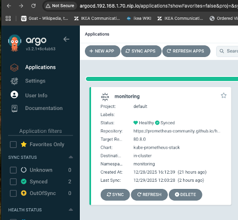
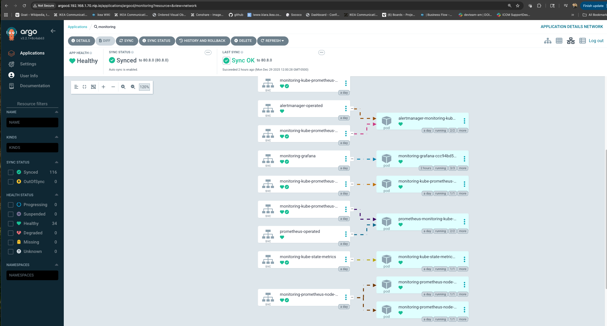
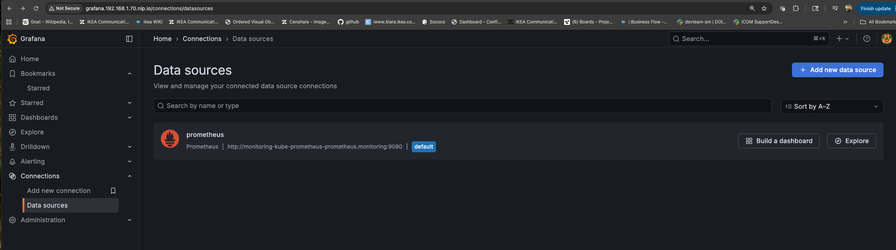
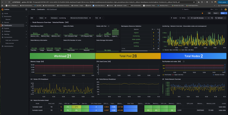
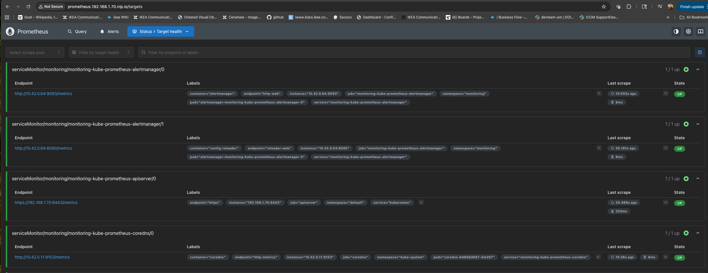

# Kubernetes Monitoring with ArgoCD, Prometheus & Grafana

This directory contains a production-style Kubernetes monitoring stack deployed using **GitOps principles** with ArgoCD.  
The setup provides **cluster observability, persistent Grafana dashboards, and safe credential management**.

The goal of this setup is not just to install monitoring, but to demonstrate **operability, recovery, and real-world troubleshooting**.

---

## Architecture Overview

This monitoring stack is deployed using the `kube-prometheus-stack` Helm chart and managed entirely by ArgoCD.

**Key characteristics:**
- Fully GitOps-managed (no manual kubectl applies)
- Persistent Grafana data across pod restarts
- Kubernetes-native secrets for credentials
- Automated reconciliation and self-healing via ArgoCD

---

## Components Used

- **ArgoCD** – GitOps deployment, drift detection, and self-healing
- **Prometheus Operator** – Metrics collection and lifecycle management
- **Prometheus** – Time-series metrics storage
- **Grafana** – Visualization and dashboards
- **Kubernetes PVCs** – Persistent storage for Grafana and Prometheus
- **Kubernetes Secrets** – Secure handling of Grafana admin credentials

---

## Screenshots

### ArgoCD
| Monitoring app Healthy/Synced | Resource tree |
|---|---|
|  |  |

### Grafana
| Prometheus datasource test | Kubernetes dashboard |
|---|---|
|  |  |

### Prometheus


---

## Repository Structure

```text
apps/monitoring/
├── application.yaml        # ArgoCD Application definition
├── helm/
│   └── values.yaml         # Helm values for kube-prometheus-stack
├── ingress/
│   └── grafana-ingress.yaml
├── namespace.yaml
└── README.md

```

---

## Persistence & Recovery 

Grafana uses a PersistentVolumeClaim backed by the local-path storage class.
Dashboards, users, and settings survive pod restarts.

Tested by:
- Deleting the Grafana pod
- Verifying dashboards and data remained intact

---

## Secrets Handling

Grafana admin credentials are stored in a Kubernetes Secret
and injected via Helm values using existingSecret.

Secrets are not hardcoded in Git.

•	ArgoCD application in Healthy state

---


## Future Improvements 

Planned improvements:
- Application-level metrics via ServiceMonitor
- Ingress metrics dashboards
- Alerting rules for critical conditions
- Loki for log aggregation


